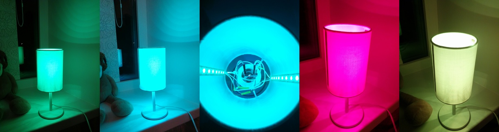

# RGB LED Lamp

This is a simple mood lamp which gradually changes its color according to HSV color model.

## Build setup

1. Arduino Nano.
2. WS2812 LED strip.
3. Power supply (5V). Each RGB LED draws approximately 50 mA. If you have 20 LEDs, then you will need a 5V power supply capable of delivering at least 1A (and more is better).
4. Lamp. I took a cheap one, pulled out a socket, and replaced it with an Arduino wired to both LED strips and power supply (see photo above).

## Example wiring

## Arduino sketch

I had two LED strips wired in parallel, so I addressed both of them in `led-lamp-sketch.ino` file. You may change it for your needs. [FastLED](https://github.com/FastLED/FastLED) library is required for compilation.
